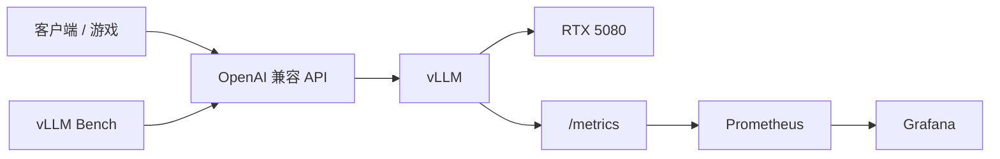

# vLLM 完整推理服务 Implementation Plan

## Goal Description
交付一个可调用、可观测、可压测、可复现的单机大模型推理服务，并通过实验解释不同优化对延迟、吞吐和显存的影响。最终目标是完成一个可以写进简历、能够复现实验的完整项目。

**项目设定**：在 RTX 5080 16GB + Windows 11 环境下，通过 WSL2 和 Docker 部署 Qwen3-8B-AWQ，提供 OpenAI 兼容 API，接入 Prometheus/Grafana，完成并发压测和三组优化实验，输出性能报告。只使用单卡，跳过多卡/多节点配置。

## 0. 最终架构与目录结构



**目录结构：**
```text
vllm-serving-lab/
├── compose.yaml
├── configs/
│   └── prometheus.yaml
├── scripts/
│   ├── smoke_test.sh
│   ├── benchmark.sh
│   └── run_experiments.sh
├── clients/
│   └── chat_client.py
├── tests/
│   └── test_api.py
├── dashboards/
│   └── grafana.json
├── results/
│   ├── baseline/
│   ├── prefix-cache/
│   ├── chunked-prefill/
│   └── quantization/
├── docs/
│   ├── architecture.md
│   └── benchmark-report.md
└── README.md
```

## User Review Required

> [!IMPORTANT]
> **关于环境的准备 (WSL2 + Docker Desktop)**
> 1. Windows 端只需安装普通的 NVIDIA Game/Studio 驱动。
> 2. **切记不要**在 WSL 内部运行 `sudo apt install nvidia-driver-*`，也不用安装完整 CUDA Toolkit。Windows 驱动会自动映射进 WSL。
> 3. 项目文件夹请建在 WSL 内部（例如 `~/projects/vllm-serving-lab`），而不是 `/mnt/c`，以保证 IO 性能。
> 4. Docker Desktop 中必须在 `Settings → Resources → WSL Integration` 勾选您安装的 Ubuntu 发行版。
> 5. **【关键】针对本地磁盘空间不足的优化**：
>    - 本项目最低约需 **25-30 GB** 的可用空间（Docker 镜像 ~10GB，模型缓存 ~8GB，WSL 系统 ~5GB）。
>    - 如果您的 C 盘吃紧，我们可以通过设置环境变量 `HF_HOME` 将模型下载到其他盘，或者在 Docker Desktop 中将虚拟磁盘 (`ext4.vhdx`) 迁移到 D 盘。
>    - 我们将**只下载**量化版的模型（4-bit AWQ 版通常在 5-6GB，远小于全精度的 16GB）。

## Open Questions

> [!WARNING]
> 我们马上将进入第一步：在您的 WSL Ubuntu 终端里执行 `nvidia-smi` 验证显卡，并通过 `docker run --rm -it --gpus=all nvcr.io/nvidia/k8s/cuda-sample:nbody nbody -gpu -benchmark` 验证 Docker 容器内的 GPU 透传。您准备好开始验证了吗？

## Proposed Changes (执行路径)

### Milestone 1: Windows 环境与 Docker 验证
- 更新系统与驱动。
- 安装 WSL2 (Ubuntu) 和开发工具 (`git curl jq make`)。
- 安装 Docker Desktop 并配置 WSL2 Backend。
- 跑通 Docker 的 GPU nbody 测试。

### Milestone 2: 0.6B 小模型冒烟测试
为避免一开始就被庞大的 8B 模型和参数困扰，先用小模型快速验证 vLLM 通道。
- 启动 `Qwen/Qwen3-0.6B` 临时容器。
- 验证 `/v1/models` 和基本 Chat Completions。

### Milestone 3: 启动正式模型 (8B-AWQ)
停掉小模型，启动正式的 `Qwen/Qwen3-8B-AWQ`。
- **启动参数重点：** 开启 `--enable-prefix-caching`，使用 `--generation-config vllm` 规避干扰，设置显存使用率 `--gpu-memory-utilization 0.85` 给系统留余地，挂载 `results` 目录等。
- 编写 API 测试脚本 (`test_api.py`)，验证 4K 上下文、Streaming SSE、中英文及报错恢复。

### Milestone 4: 接入可观测性 (Prometheus + Grafana)
- 编写 `compose.yaml` 将 vLLM、Prometheus 和 Grafana 统一编排。
- 在 Grafana 中配置 P50/P95/P99 TTFT, TPOT, E2E Latency, Tokens per second, Running/Waiting queue, KV Cache, GPU 利用率面板。

### Milestone 5: 建立基线压测
- 建立四种固定负载（短对话、长 Prefill、Decode-heavy、共享前缀）。
- 使用 `vllm bench serve` 进行压测，并发梯度为 1 → 2 → 4 → 8。
- 每次测试保存详尽的指标与系统配置。

### Milestone 6: 三组核心实验
1. **Prefix Caching：** 开/关对比，观察长 System Prompt 下，首次和后续请求的 TTFT 及吞吐变化。
2. **Chunked Prefill：** 对比 `max-num-batched-tokens` 在 2048、4096、8192 时的表现，观察长请求 TTFT 与短请求 TPOT 的权衡。
3. **量化对比：** 对比 4B BF16 vs 4B AWQ vs 8B AWQ 的显存占用、TTFT、TPOT 及基础输出质量。

### Milestone 7: 整理交付
- 将临时启动脚本转化为成熟的 `docker compose up -d` 流程。
- 完善各类文档与报告。

## 验收标准 (Definition of Done)

项目完成时，必须达成以下效果：
1. 能在全新 WSL2 环境按照 README 一键/分步启动。
2. Qwen3-8B-AWQ 稳定运行在 16GB RTX 5080 上。
3. 提供 OpenAI 兼容的 Chat Completions API 并支持 Streaming。
4. 能承受 1/2/4/8 并发测试而不 OOM。
5. Grafana 实时看板正常运作，能看到 TTFT、TPOT、请求队列等。
6. 完成并输出三组对照实验 (Prefix Cache, Chunked Prefill, BF16/AWQ) 的结果和 JSON 记录。
7. README 中包含架构图、运行命令、结果表格和明确结论。
8. **能够用自己的话解释**一次请求是如何经过 Tokenizer、Scheduler、Continuous Batching、PagedAttention、KV Cache 并最终流式返回的。
